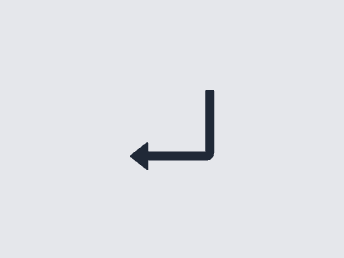

# Вордл (Wordle)

## Описание
Вордл - простая и увлекательная головоломка, в которой нужно угадать слово из 5 букв за 6 попыток.

## Как играть
1) Для начала нужно вписать любое слово в верхнюю строчку игрового поля и нажать на 
2) После каждой попытки буквы будут подсвечены разными цветами:
    - **зеленым**, если буква в вашем слове есть и стоит на том же месте, что и в загаданном слове;
    - **желтым**, если буква в вашем слове есть, но стоит не там, где надо;
    - а если ячейки вашего слова остаются **серыми**, значит в искомом слове этии буквы отсутствуют.
3) Далее, учитывая угаданные буквы, вы можете вписать новое слово, и так до тех пор, пока не угадаете загаданное слово или у вас не кончатся попытки.
Вы выигрываете, если угадаете слово раньше, чем закончатся попытки.

Если при вводе слов в строчки вы ошиблись, то символы можно стереть с помощью 

## Технологии
Написана с использованием:
- React
- Redux Toolkit
- TypeScript
- TailwindCSS
- Vite
- Redux-persist для сохранения состояния в localStorage

## Планы по расширению функционала
- Загадывание слова на сутки. После окончания дня загадывается новое слово.
- Добавление статистики
- Возможность поделиться результатом в соцсетях
- Переключение языка (русский, английский)

